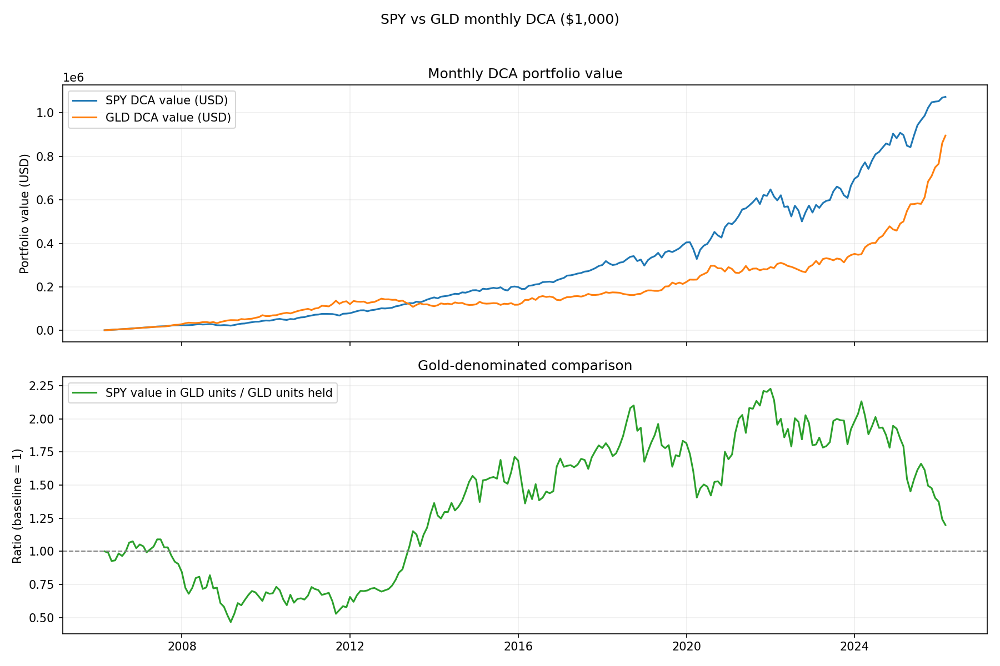

# US Stock vs Gold (SPY vs GLD)
美股 vs 黄金 (SPY vs GLD)

Monthly DCA comparison of SPY vs GLD over the last 10 years, plus a gold-denominated ratio.
过去10年 SPY 与 GLD 的月度定投对比，并给出黄金计价的比值。

## Run
运行
```
pip install pandas yfinance matplotlib
python spx_gold_compare.py
```

Output: `output/spx_gold_comparison.png`
输出：`output/spx_gold_comparison.png`
